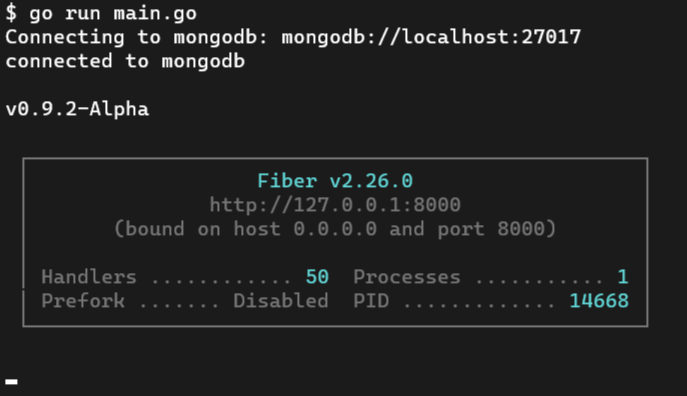

# School Management API Documentation

The School Management API Documentation, defining all functions and their purpose. As well as how to use the API, how to properly call functions and provide the necessary fields. 

### Contents

* [Getting Started](#getting-started)
* [General Functions](#general-functions)
* [Creating Accounts](#creating-accounts)
    * [Creating Administrators](#creating-administrators)
    * [Registering a Teacher](#registering-a-teacher)
    * [Enrolling a Student](#enrolling-a-student)
    * [Additional Info](#additional-information-after-creating-an-account)
* [Log into Accounts](#log-into-accounts)
	* [Logging Into Admin](#logging-into-admin)
	* [Logging Into Teacher](#logging-into-teacher)
	* [Logging Into Student](#logging-into-student)
* [Get Account](#get-account)
	* [Get Admin Account](#get-admin-account)
	* [Get Teacher Account](#get-teacher-account)
	* [Get Student Account](#get-student-account)
* [Updating Account information](#updating-accounts)
	* **Update Student...**
	* [Name](#update-student-name)
	* [Grade Level](#update-student-grade-level)
	* [Homeroom](#update-student-homeroom)
	* [Locker](#update-student-locker)
	* [YOG](#update-student-year-of-graduation)
	* [Password](#update-student-password)
	* [Email](#update-student-email)
	* [Address](#update-student-address)
	* [Photo](#update-student-photo)
    <br></br>
	* **Update Teacher...**
	* [Name](#update-teacher-name)
	* [Homeroom](#update-teacher-homeroom)
	* [Password](#update-teacher-password)
	* [Email](#update-teacher-email)
	* [Address](#update-teacher-address)
	* [Photo](#update-teacher-photo)
	<br></br>
	* **Update Admin...**
	* [Name](#update-admin-name)
	* [Password](#update-admin-password)
	* [Email](#update-admin-email)
* [Managing Contacts](#managing-contacts)
	* [Create Contact](#create-contact)
	* [Update Contact Name](#update-contact-name)
	* [Update Contact Address](#update-contact-address)
	* [Update Contact Home Phone](#update-contact-home-phone)
	* [Update Contact Work Phone](#update-contact-work-phone)
	* [Update Contact Email](#update-contact-email)
	* [Update Contact Priority](#update-contact-priority)
	* [Delete Contact](#delete-contact)
* [Remove Users](#remove-users)
    * [Remove Admin](#remove-admin)
    * [Remove Teacher](#remove-teacher)
    * [Remove Student](#remove-student)
* [Admin Commands](#admin-commands)
    * [Update Locker Combination](#update-locker-combination)
    * [Enable Student Account](#enable-student-account)
    * [Enable Teacher Acccount](#enable-teacher-account)

<br>

## Getting Started 

* ### Installation & Deployment
    The API is an all in one package and is simple and easy to deploy. Eliminating any long unforgiving configurations you may face in other software.

    1. Clone the repo
        ```bash
        $ git clone https://github.com/SowinskiBraeden/school-management-api
        $ cd school-management-api
        ```
    
    2. Rename `.env.example` to `.env`
    
    3. Enter desired values into `.env`
        ```bash
        mongoURI='your mongo URI'
        dbo='school'
        secret='your 256 bit secret'
        
        # Suggested port for Production: 80
        # Suggested port for Development: 8000
        PORT='desired port'
        
        # This is to enable the system to send emails
        SYSTEM_EMAIL='your system email'
        SYSTEM_PASSWORD='your system email password'
        ```
    
    4. Run the system in your terminal
        ```bash
        $ go run main.go
        ```
    
    Or...
    
    5. Build and compile the system into an executable
        ```bash
        $ go build
        ```

* ### Initializing the System

    Upon running the system for the first time, you will be prompted to create an admin.
    In order to perform many actions with the API, an Admin account is required. You will be prompted to create your default admin account seen below...
    
    
    
    Upon completing the initial setup and creating your default administrator for the system, it is ready to use and this box will appear below, displaying basic system details seen below...
    
    
    
<br>

## General Functions

* ### API Status
    **Method:** `GET`
    ```
    <API_URL>/api/v1/status
    ```
    
    **Returns:**
    * Status 200: `OK`
    * JSON: 
        ```jsonc
        {
            "success": true,
            "message": "the API is active"
        }
        ```

<br>
  
## Creating Accounts

There are several account that can be registered into the system. As you may guess they are Administrators, Teachers and Students.

<br>

+ ### Creating Administrators
    You can create Administrates- who will have permissions to perform majority of the actions in the API. It is common that there are more than one Administrator to help manage the system.

    **Method:** `POST`
    ```
    <API_URL>/api/v1/admin/create
    ```
    
    **Required:**
    + Logged into an existing Admin account
    + JSON:
        ```jsonc
        {
            "firstname": "John",
            "lastname": "Doe",
            "dob": "01-01-1999",
            "email": "john_doe@example.com"
        }
        ```
    
    **Returns:**
    + Status 200: `OK`
    + JSON:
        ```jsonc
        {
            "success": true,
            "message": "successfully inserted admin"
        }
        ```
    
    <br>
    
+ ### Registering a Teacher
    Obviously a school management system will require teachers to manage and teach students. Teachers have an important role for the system.

    **Method:** `POST`
    ```
    <API_URL>/api/v1/teacher/register
    ```
    
    **Required:**
    + Logged into an existing Admin account
    + JSON:
        ```jsonc
        {
            "firstname": "Homer",
            "middlename": "Jay",
            "lastname": "Simson",
            "dob": "12-05-1956",
            "email": "homerdog_simpson@example.com"
        }
        ```
    
    **Returns:**
    + Status 200: `OK`
    + JSON:
        ```jsonc
        {
            "success": true,
            "message": "successfully inserted teacher"
        }
        ```
        
+ ### Enrolling a Student
    What is a school without students? A professional day, but not the point. Students when their application to the school has been accepted by an admin can be enrolled into the school.

    **Method:** `POST`
    ```
    <API_URL>/api/v1/student/enroll
    ```
    
    **Required:**
    + Logged into an existing Admin account
    + JSON:
        ```jsonc
        {
            "firstname": "Bart",
            "middlename": "JoJo",
            "lastname": "Simpson",
            "age": 10,
            "gradelevel": 4,
            "dob": "17-12-1979",
            "province": "...",
            "city": "Springfield",
            "address": "742 Evergreen Terrace",
            "postal": "..."
        }
        ```
        
    **Returns:**
    + Status 200: `OK`
    + JSON:
        ```jsonc
        {
            "success": true,
            "successfully inserted student"
        }
        ```
        
+ ### Additional Information After creating an account
    1. After successfully creating an account for another admin, teacher or student. A school email will be generated for them using their first and last name, each formatted differently based on the type of account.

    2. All users are given a random ID used to sign into the system. Each ID is a random 6 digit number.
    
    3. Students are given a random PEN (Personal Education Number). A random 12 digit number.
    
    4. Accounts are given a default profile image. This can be updated in the future.
    
    **(Coming Soon)**
    5. All new users, once have verified their email, will receive and email containing their ID.
    
    **(Currently No verified email required)**
    6. All new users, once have verified their email, will receive and email containing their temporary password.

<br>

## Log Into Accounts

+ ### Logging into Admin
	**Method:** `POST`
	```
	<API_URL>/api/v1/admin/login
	```

	**Required:**
	* JSON:
		```jsonc
		{
			"tid": "123456",
			"password": "myawesomepassword123"
		}
		```
		
	**Returns:**
	* Status 200: `OK`
	* JSON:
		```
		{
			"success": true,
			"message": "correct password"
		}
		```

<br>

+ ### Logging into Teacher
	**Method:** `POST`
	```
	<API_URL>/api/v1/teacher/login
	```

	**Required:**
	* JSON:
		```jsonc
		{
			"tid": "123456",
			"password": "myawesomepassword123"
		}
		```
		
	**Returns:**
	* Status 200: `OK`
	* JSON:
		```jsonc
		{
			"success": true,
			"message": "correct password"
		}
		```

<br>

+ ### Logging into Student
	**Method:** `POST`
	```
	<API_URL>/api/v1/student/login
	```

	**Required:**
	* JSON:
		```jsonc
		{
			"sid": "123456",
			"password": "myawesomepassword123"
		}
		```
		
	**Returns:**
	* Status 200: `OK`
	* JSON:
		```jsonc
		{
			"success": true,
			"message": "correct password"
		}
		```

<br>

## Get Account

+ ### Get Admin Account
	**Method:** `GET`
	```
	<API_URL>/api/v1/admin
	```

	**Required:**
	* Logged into an admin account
	
	**Returns:**
	* Status 200: `OK`
	* JSON:
		```jsonc
		{
			"success": true,
			"message": "successfully logged into admin",
			"admin:" <admin object>
		}
		```

<br>

+ ### Get Teacher Account
	**Method:** `GET`
	```
	<API_URL>/api/v1/teacher
	```

	**Required:**
	* Logged into an teacher account
	
	**Returns:**
	* Status 200: `OK`
	* JSON:
		```jsonc
		{
			"success": true,
			"message": "successfully logged into teacher",
			"teacher:" <teacher object>
		}
		```

<br>

+ ### Get Student Account
	 **Method:** `GET`
	```
	<API_URL>/api/v1/student
	```

	**Required:**
	* Logged into an admin account
	
	**Returns:**
	* Status 200: `OK`
	* JSON:
		```jsonc
		{
			"success": true,
			"message": "successfully logged into teacher",
			"student:" <student object>
		}
		```

<br>

## Updating Account Information

+ ### Update Student Name
    **Method:** `POST`
	```
	<API_URL>/api/v1/student/updateName
	```

	**Required:**
	* Logged into an admin account
    * JSON:
        ```jsonc
        {
            "sid": "123456",
            "firstname": "Lisa",
            "middlename": "Marie", // (OPTIONAL)
            "lastname": "Simpson"
        }
        ```

	**Returns:**
	* Status 200: `OK`
	* JSON:
		```jsonc
		{
			"success": true,
			"message": "successfully updated student"
		}
		```

<br></br>

+ ### Update Student Grade Level
    **Method:** `POST`
	```
	<API_URL>/api/v1/student/updateGradeLevel
	```

	**Required:**
	* Logged into an admin account
	* JSON":
	    ```jsonc
	    {
	        "sid": "123456",
	        "gradelevel": 11
	    }
	    ```
	
	**Returns:**
	* Status 200: `OK`
	* JSON:
		```jsonc
		{
			"success": true,
			"message": "successfully updated student"
		}
		```

<br></br>

+ ### Update Student Homeroom
    **Method:** `POST`
	```
	<API_URL>/api/v1/student/updateHomeroom
	```

	**Required:**
	* Logged into an admin account
    * JSON:
        ```jsonc
        {
            "sid": "123456",
            "homeroom": "A123"
        }
        ```

	**Returns:**
	* Status 200: `OK`
	* JSON:
		```jsonc
		{
			"success": true,
			"message": "successfully updated student"
		}
		```

<br></br>

+ ### Update Student Locker
    **Method:** `POST`
	```
	<API_URL>/api/v1/student/updateLocker
	```

	**Required:**
	* Logged into an admin account
	* JSON:
	    ```jsonc
	    {
	        "sid": "123456",
	        "lockernumber": "B123"
	    }
	    ```
	
	**Returns:**
	* Status 200: `OK`
	* JSON:
		```jsonc
		{
			"success": true,
			"message": "successfully updated student"
		}
		```

<br></br>

+ ### Update Student Year of Graduation
    **Method:** `POST`
	```
	<API_URL>/api/v1/student/updateYOG
	```

	**Required:**
	* Logged into an admin account
	* JSON:
	    ```jsonc
	    {
	        "sid": "123456",
	        "yog": 2020
	    }
	    ```
	
	**Returns:**
	* Status 200: `OK`
	* JSON:
		```jsonc
		{
			"success": true,
			"message": "successfully updated student"
		}
		```

<br></br>

+ ### Update Student Password
    **Method:** `POST`
	```
	<API_URL>/api/v1/student/updatePassword
	```

	**Required:**
	* Logged into students account
	* JSON:
		```jsonc
		{
			"password": "myOldPassword",
			"newpassword1": "myNewPassword",
			"newpassword2": "myNewPassword"
		}
		```
	
	**Returns:**
	* Status 200: `OK`
	* JSON:
		```jsonc
		{
			"success": true,
			"message": "successfully updated student password"
		}
		```
	* Emails student an alert of password change

<br></br>

+ ### Update Student Email
    **Method:** `POST`
	```
	<API_URL>/api/v1/student/updateEmail
	```

	**Required:**
	* Logged into an admin account
	__or__
	* Logged into students account
	* JSON:
		```jsonc
		{
			"sid": "123456", // (Only required if signed in as admin)
			"email": "BartSimpsonsCoolEmail@example.com"
		}
		```
	
	**Returns:**
	* Status 200: `OK`
	* JSON:
		```jsonc
		{
			"success": true,
			"message": "successfully updated"
		}
		```

<br></br>

+ ### Update Student Address
    **Method:** `POST`
	```
	<API_URL>/api/v1/student/updateAddress
	```

	**Required:**
	* Logged into an admin account
	* JSON:
	    ```jsonc
	   {
	       "sid": "123456",
	       "address": "742 Evergreen Terrace",
	       "city": "Springfield",
	       "province": "...",
	       "postal": "..."
	   }
	    ```
	
	**Returns:**
	* Status 200: `OK`
	* JSON:
		```jsonc
		{
			"success": true,
			"message": "successfully updated student"
		}
		```

<br></br>

+ ### Update Student Photo
    **Method:** `POST`
	```
	<API_URL>/api/v1/student/updatePhoto
	```

	**Required:**
	* Logged into an admin account
    * Form Submission:
        ```
            sid: "123456"
            image: newStudentPhoto.png
        ```

	**Returns:**
	* Status 200: `OK`
	* JSON:
		```jsonc
		{
			"success": true,
			"message": "successfully updated student photo"
		}
		```

<br></br>

+ ### Update Teacher Name
    **Method:** `POST`
	```
	<API_URL>/api/v1/teacher/updateName
	```

	**Required:**
	* Logged into an admin account
    * JSON:
        ```jsonc
        {
            "tid": "123456",
            "firstname": "Marjorie",
            "middlename": "Jacqueline", // (Optional)
            "lastname": "Simpson"
        }
        ```

	**Returns:**
	* Status 200: `OK`
	* JSON:
		```jsonc
		{
			"success": true,
			"message": "successfully updated teacher"
		}
		```

<br></br>

+ ### Update Teacher Homeroom
    **Method:** `POST`
	```
	<API_URL>/api/v1/teacher/updateHomeroom
	```

	**Required:**
	* Logged into an admin account
	* JSON:
	    ```
	    {
	        "tid": "123456",
	        "homeroom": "A123"
	    }
	    ```
	
	**Returns:**
	* Status 200: `OK`
	* JSON:
		```jsonc
		{
			"success": true,
			"message": "successfully updated teacher"
		}
		```

<br></br>

+ ### Update Teacher Password
    **Method:** `POST`
	```
	<API_URL>/api/v1/teacher/updatePassword
	```

	**Required:**
	* Logged into teacher account
	* JSON:
	    ```jsonc
	        {
	            "password": "myOldPassword",
	            "newpassword1": "myNewPassword",
	            "newpassword2": "myNewPassword"
	        }
	    ```
	
	**Returns:**
	* Status 200: `OK`
	* JSON:
		```jsonc
		{
			"success": true,
			"message": "successfully updated teacher password"
		}
		```
	* Emails teacher an alert of password change

<br></br>

+ ### Update Teacher Email
    **Method:** `POST`
	```
	<API_URL>/api/v1/teacher/updateEmail
	```

	**Required:**
	* Logged into an admin account
	**or**
    * Logged into teachers account
    * JSON:
        ```jsonc
        {
            "tid": "123456", // (Only required if igned in as admin)
            "email": "MargeSimpson@example.com"
        }
        ```
	
	**Returns:**
	* Status 200: `OK`
	* JSON:
		```jsonc
		{
			"success": true,
			"message": "successfully updated teacher"
		}
		```

<br></br>

+ ### Update Teacher Address
    **Method:** `POST`
	```
	<API_URL>/api/v1/teacher/updateAddress
	```

	**Required:**
	* Logged into an admin account
	* JSON:
	    ```jsonc
	    {
	        "tid": "123456",
	        "address": "742 Evergreen Terrace",
	        "city": "Springfield",
	        "province": "...",
	        "postal": "..."
	    }
	    ```
	
	**Returns:**
	* Status 200: `OK`
	* JSON:
		```jsonc
		{
			"success": true,
			"message": "successfully updated teacher"
		}
		```

<br></br>

+ ### Update Teacher Photo
    **Method:** `POST`
    ```
    <API_URL>/api/v1/teacher/updatePhoto
    ```

    **Required:**
    * Logged into an admin
    * Form Submission:
        ```
            tid: "123456"
            image: newTeacherPhoto.png
        ```
        
    **Returns:**
    * Status 200: `OK`
    * JSON:
        ```jsonc
        {
            "success": true,
            "message": "successfully updated teacher photo"
        }
        ```

<br></br>

+ ### Update Admin Name
    **Method:** `POST`
    ```
    <API_URL>/api/v1/admin/updateName
    ```

    **Required:**
    * Logged into the admin
    * JSON:
        ```jsonc
        {
            "firstname": "Seymour",
            "lastname": "Skinner"
        }
        ```
        
    **Returns:**
    * Status 200: `OK`
    * JSON:
        ```jsonc
        {
            "success": "true",
            "message": "successfully updated admin"
        }
        ```

<br></br>

+ ### Update Admin Password
    **Method:** `POST`
    ```
    <API_URL>/api/v1/admin/updateEmail
    ```

    **Required:**
    * Logged into the admin
    * JSON:
        ```jsonc
        {
            "firstname": "seymour_skinner@example.com"
        }
        ```
        
    **Returns:**
    * Status 200: `OK`
    * JSON:
        ```jsonc
        {
            "success": "true",
            "message": "successfully updated admin"
        }
        ```

<br></br>

+ ### Update Admin Email
    **Method:** `POST`
    ```
    <API_URL>/api/v1/admin/updatePassword
    ```

    **Required:**
    * Logged into the admin
    * JSON:
        ```jsonc
        {
            "password": "myOldPassword",
            "newpassword1": "myNewPassword",
            "newpassword2": "myNewPassword"
        }
        ```
        
    **Returns:**
    * Status 200: `OK`
    * JSON:
        ```jsonc
        {
            "success": "true",
            "message": "successfully updated admin password"
        }
        ```
    * Emails admin ab alert of password change

<br></br>

## Managing Conacts
In the case of an emergency for a specified student, a contact is required to be alerted during a situation. There can be multiple contacts with ranging priorities to ensure the correct person(s) are reached.

+ ### Create Contact
	**Method:** `POST`
    ```
    <API_URL>/api/v1/contact/createContact
    ```

    **Required:**
    * Logged into the admin
    * JSON:
        ```jsonc
        {
            "sid": "123456",
            "firstname": "Marge",
            "middlename": "Jacqueline", // (optional)
            "lastname": "Simpson",
            "homephone": "123-456-7890",
            "workphone": "098-765-4321"
            "email": "therealmarge@example.com",
            "priority": 1, // 1 is highest priority, 10 is least priority
            "relation": "mother",
            "province": "...",                  // (optional)
            "city": "Springfield",              // (optional)
            "address": "742 Evergreen Terrace", // (optional)
            "postal": "                         // (optional)
        }
        ```
        
    **Returns:**
    * Status 200: `OK`
    * JSON:
        ```jsonc
        {
            "success": "true",
            "message": "successfully inserted contact to student"
        }
        ```
    * Emails admin ab alert of password change

<br></br>

+ ### Update Contact Name
	**Method:** `POST`
    ```
    <API_URL>/api/v1/contact/updateName
    ```

    **Required:**
    * Logged into the admin
    * JSON:
        ```jsonc
        {
            "_id": "<contact object id>",
            "firstname": "Marge",
            "middlename": "" // (optional)
            "lastname": "Simpson"
        }
        ```
        
    **Returns:**
    * Status 200: `OK`
    * JSON:
        ```jsonc
        {
            "success": "true",
            "message": "successfully updated contact"
        }
        ```

<br></br>

+ ### Update Contact Address
	**Method:** `POST`
    ```
    <API_URL>/api/v1/contact/updateAddress
    ```

    **Required:**
    * Logged into the admin
    * JSON:
        ```jsonc
        {
            "_id": "<contact object id>",
            "address": "742 Evergreen Terrace",
            "city": "Springfield",
            "province": "...",
            "postal": "..."
        }
        ```
        
    **Returns:**
    * Status 200: `OK`
    * JSON:
        ```jsonc
        {
            "success": "true",
            "message": "successfully updated contact"
        }
        ```

<br></br>

+ ### Update Contact Home Phone
	**Method:** `POST`
    ```
    <API_URL>/api/v1/contact/updateHomePhone
    ```

    **Required:**
    * Logged into the admin
    * JSON:
        ```jsonc
        {
            "_id": "<contact object id>",
            "newnumber": "123-456-7890"
        }
        ```
        
    **Returns:**
    * Status 200: `OK`
    * JSON:
        ```jsonc
        {
            "success": "true",
            "message": "successfully updated contact"
        }
        ```

<br></br>

+ ### Update Contact Work Phone
	**Method:** `POST`
    ```
    <API_URL>/api/v1/contact/updateWorkPhone
    ```

    **Required:**
    * Logged into the admin
    * JSON:
        ```jsonc
        {
            "_id": "<contact object id>",
            "newnumber": "123-456-7890"
        }
        ```
        
    **Returns:**
    * Status 200: `OK`
    * JSON:
        ```jsonc
        {
            "success": "true",
            "message": "successfully updated contact"
        }
        ```

<br></br>

+ ### Update Contact Email
	**Method:** `POST`
    ```
    <API_URL>/api/v1/contact/updateEmail
    ```

    **Required:**
    * Logged into the admin
    * JSON:
        ```jsonc
        {
            "_id": "<contact object id>",
            "email": "marge_simpson@example.com"
        }
        ```
        
    **Returns:**
    * Status 200: `OK`
    * JSON:
        ```jsonc
        {
            "success": "true",
            "message": "successfully updated contact"
        }
        ```

<br></br>

+ ### Update Contact Priority
	**Method:** `POST`
    ```
    <API_URL>/api/v1/contact/updatePriority
    ```

    **Required:**
    * Logged into the admin
    * JSON:
        ```jsonc
        {
            "_id": "<contact object id>",
            "priority": 1 // 1: highest priority, 10 lowest priority
        }
        ```
        
    **Returns:**
    * Status 200: `OK`
    * JSON:
        ```jsonc
        {
            "success": "true",
            "message": "successfully updated contact"
        }
        ```

<br></br>

+ ### Delete Contact
	**Method:** `POST`
    ```
    <API_URL>/api/v1/contact/deleteContact
    ```

    **Required:**
    * Logged into the admin
    * JSON:
        ```jsonc
        {
            "_id": "<contact object id>"
        }
        ```
        
    **Returns:**
    * Status 200: `OK`
    * JSON:
        ```jsonc
        {
            "success": "true",
            "message": "successfully deleted contact"
        }
        ```

<br></br>

## Remove Users
Students and staff are bound to leave the school at some time, so there is a way to remove them from the sytem database permanetly for any case.

+ ### Remove Admin
    **Method:** `POST`
    ```
        <API_URL>/api/v1/remove/admin
    ```
    
    **Required:**
    * Logged into an admin
    * JSON:
        ```jsonc
        {
            "aid": "123456"
        }
        ```
        
    **Returns:**
    * Status 200: `OK`
    * JSON:
        ```jsonc
        {
            "success": true,
            "message": "successfully deleted admin"
        }
        ```

<br></br>

+ ### Remove Teacher
	**Method:** `POST`
    ```
        <API_URL>/api/v1/remove/teacher
    ```
    
    **Required:**
    * Logged into an admin
    * JSON:
        ```jsonc
        {
            "tid": "123456"
        }
        ```
        
    **Returns:**
    * Status 200: `OK`
    * JSON:
        ```jsonc
        {
            "success": true,
            "message": "successfully deleted teacher"
        }
        ```

<br></br>

+ ### Remove Student
	**Method:** `POST`
    ```
        <API_URL>/api/v1/remove/student
    ```
    
    **Required:**
    * Logged into an admin
    * JSON:
        ```jsonc
        {
            "sid": "123456"
        }
        ```
        
    **Returns:**
    * Status 200: `OK`
    * JSON:
        ```jsonc
        {
            "success": true,
            "message": "successfully deleted student"
        }
        ```

<br></br>

### Admin Commands
Administrators play a very important role in managing a school, they do much work behind the scenes to make sure that everything is correctly organized and working.

+ ### Update Locker Combination
	It is likely a school changes out their lockers, swapping the locks randomly. In the case a locker requires a combination change in the database, admins can update the locker database via this API endpoint.

    **Method:** `POST`
    ```
        <API_URL>/api/v1/admin/updateLockerCombo
    ```
    
    **Required:**
    * Logged into an admin
    * JSON:
        ```jsonc
        {
            "lockernumber": "B461",
            "newlockercombo": "51-21-49"
        }
        ```
        
    **Returns:**
    * Status 200: `OK`
    * JSON:
        ```jsonc
        {
            "success": true,
            "message": "successfully updated locker"
        }
        ```

<br></br>

+ ### Enable Student Account
    In the case a students acount has been disabled, an admin would require to enable the account.

	**Method:** `POST`
    ```
        <API_URL>/api/v1/admin/enableStudent
    ```
    
    **Required:**
    * Logged into an admin
    * JSON:
        ```jsonc
        {
            "sid": "123456"
        }
        ```
        
    **Returns:**
    * Status 200: `OK`
    * JSON:
        ```jsonc
        {
            "success": true,
            "message": "successfully enabled student account"
        }
        ```
<br></br>

+ ### Enable Teacher Account
    In the case a teachers acount has been disabled, an admin would require to enable the account.

	**Method:** `POST`
    ```
        <API_URL>/api/v1/admin/enableTeacher
    ```
    
    **Required:**
    * Logged into an admin
    * JSON:
        ```jsonc
        {
            "tid": "123456"
        }
        ```
        
    **Returns:**
    * Status 200: `OK`
    * JSON:
        ```jsonc
        {
            "success": true,
            "message": "successfully enabled teacher account"
        }
        ```
<br></br>
